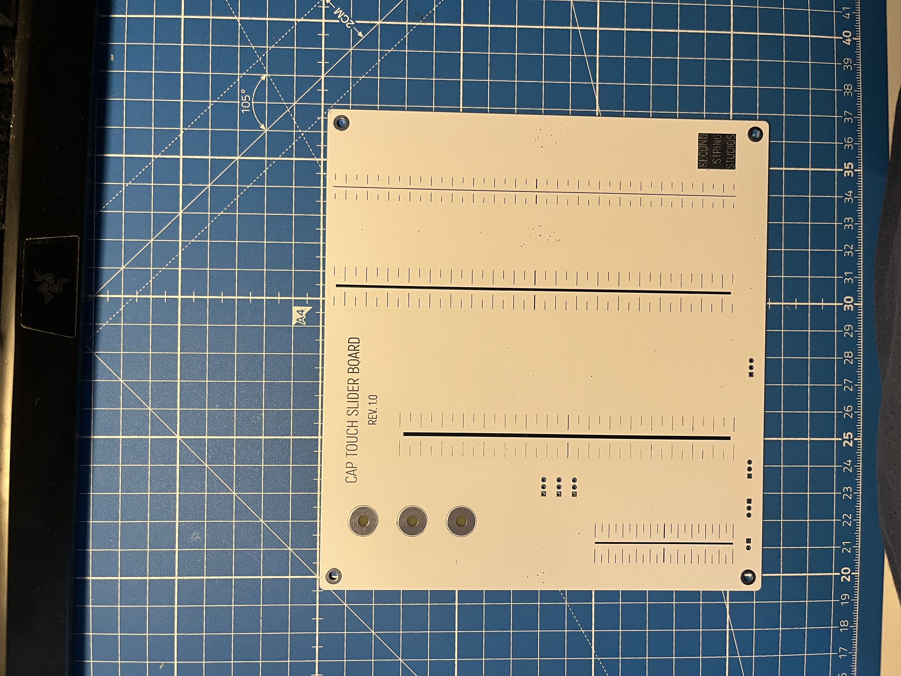

# capacitive-touch-slider-board-prototype

This repo contains a design for a prototype PCB for testing different capacitive touch slider designs. For more information on the different slider footprints, see [writeup](https://brian.team/engineering/capacitive-touch-protoype-pcbs/).

There is a schematic PDF and PCB layer prints PDF in the version 1.0 directory if you do not have KiCad. There are also Excel and interactive BOMs in the `bom/` subdirectory.

Reach out if you would like the KiCad slider schematic symbol and footprint files, they are saved in my global library and so not directly accessible from the project directory.

There is test firmware in `slider-board_rev_1_0/bringup_firmware/`. **NOTE:** This firmware is sloppy, terribly written, inefficient, and everything is hardcoded. It is only included as a reference, do not think that this will work for you out of the box.

Videos of example behavior are in the `img/` directory.
